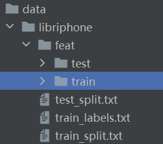
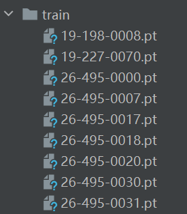
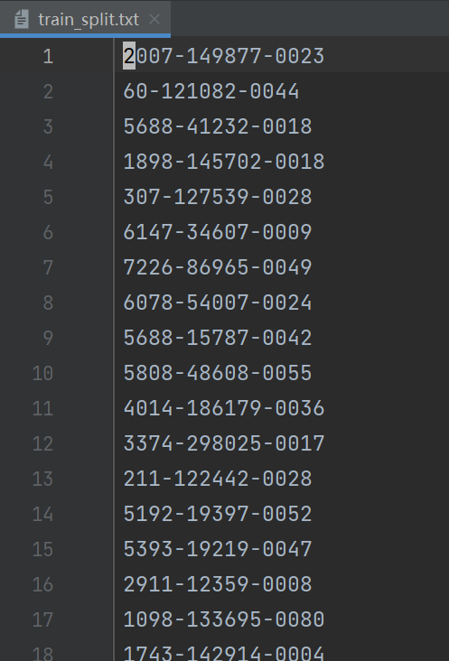
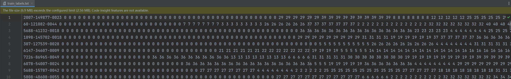

# LibriSpeech Phoneme Classification

Kaggle 竞赛地址：[Frame-wise phoneme classification on the LibriSpeech Dataset.](https://www.kaggle.com/c/ml2022spring-hw2)

## 数据与任务描述

在任务描述的 PPT 中（./resources/description_slides.ppt），涉及了一些 Speech 背景的知识，难免容易将缺乏 Speech 背景的同学吓到，但实际上，不了解这些知识完全没有关系。只需要记住，这是一个 41 分类的多分类任务就好了。

接下来介绍一下数据的格式。数据文件的目录树如图：

其中，*feat* 目录包含了训练和测试的数据文件，以训练数据为例：

每一份 `.pt` 文件都对应一条语音，一条语音可以通过 `torch.load` 加载得到一个形状为 `(T, 39)` 的 tensor 数据，其中 T 代表时间维度，39 代表特征向量的特征维度（MFCC）。时间维度 `T` 上的每一个 39 维的特征向量，都分别代表了一个小小的时间窗口（frame）所对应的音频的特征表示。任务需要做的就是预测每个 frame 中的音频发音属于哪一个 phoneme。至于 phoneme，可以理解成类似音标的东西，一共有 41 类 phoneme，所以这是一个 41 分类的任务。

*test_split.txt*、*train_split.txt* 和 *train_labels.txt* 都是元数据文件。其中 *train_split.txt* 和 *test_split.txt* 文件中保存了 *feat* 目录下的数据文件的文件名，一行对应一个文件：

*train_labels.txt* 指明了训练数据中每个 frame 的 MFCC 特征与 phoneme 标签的关系：

如图，每一行代表一个文件的信息，每个文件的信息通过 ` ' '` 分隔，每一行首先是文件名，后面跟的数字代表了该文件加载后，每个 frame 的类别。我们没有 *test_labels.txt*，我们的任务就是用训练好的模型，然后预测 *test_split.txt* 中的文件的每个 frame 所属的 label。
